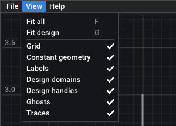

# The GUI

`geomsolver` is the interactive program. It draws the instance, checks the design on every change, and lets you edit every expression and solve without leaving the window. This page walks through each part of the window on the frozen copy of the [corner TV example](../examples/tv-corner.md), `tests/data/tv_corner_ref.json`.

Start it with an instance file:

```bash
./build/geomsolver tests/data/tv_corner_ref.json
```

Without a file, it opens `./data/tv_corner.json`, or else `../data/tv_corner.json` relative to the directory of the executable.

## The window

![The geomsolver window on the corner TV example after a solve. Menu bar at the top with File, View, Help and "unsaved changes". On the left, the canvas shows the room (fridge, table, chair, couch, TV cabinet) and the four-bar linkage in the corner with ghosts of the TV's motion; the top right reads "feasible on 2001 samples" and "minimize protrusion = 104.3729 cm". Below the canvas, the tau slider with Play, 4.0 s and loop; below that, the Margins tab with one curve per for-all row. On the right, the Inspector tab lists the design variables A, B, c, d, p0, phi0, span, tstar and the constraints couch, fridge, table, chair, pivot_spacing and bracket_spacing with their green margins.](../assets/screenshots/start-overview.png)

The window has five areas:

| Area | Content |
| --- | --- |
| **Menu bar** | File, View and Help menus, then "unsaved changes" when the document differs from the file and "solving..." while a job runs |
| **Canvas** | the scene at the current sweep value, top left |
| **Sweep bar** | one slider per sweep, under the canvas |
| **Bottom tabs** | Margins and Messages |
| **Right tabs** | Inspector and Solver |

Drag the bar between the left and right parts, or between the canvas and the bottom tabs, to resize them. The window title shows the file name, followed by `*` when there are unsaved changes.

## The canvas

The canvas draws, from back to front:

- the constant geometry in grey, with point entries as small diamonds;
- the domains of the free design points, dashed in blue;
- the traces and ghosts of the `display` items, faded;
- the `display` items at the current sweep value, in their colours;
- the design points: an orange handle for a free point, a grey square for a fixed one.

To move around:

- drag empty space with the left button, or drag with the middle or right button, to pan;
- turn the wheel to zoom at the cursor;
- press <kbd>F</kbd> to fit everything, <kbd>G</kbd> to fit the design (the display items, their ghosts and traces, and the handles). The keys act while the pointer is over the canvas.

Drag an orange handle to move a design point: it stays inside its domain. Hover a handle, a display item or a geometry entry to see its name and value, and the `note` of a design point or a geometry entry. The bottom right corner shows the coordinates under the pointer and the current scale.

The top right corner reports on the current design:

- `feasible on 2001 samples`, or the largest violation and the row it belongs to;
- the objective and its value, such as `minimize protrusion = 104.3729 cm`;
- the value of each `display` item that is a scalar;
- `Showing the last model that compiled (the document has errors)` while an edit does not compile.

When a row is violated at the current sweep value, the canvas gets a red frame and a "Violated here" box that lists those rows with their violation in natural units. A row that does not depend on the sweep is marked `(every position)`.


The View menu fits the view and toggles each layer:



## The sweep bar

Each sweep has one row under the canvas:

- **Play** / **Pause** runs the motion;
- the slider sets the sweep value, between the sweep's `min` and `max`;
- the period is the number of seconds for a full sweep (4.0 s at start);
- the mode is `loop`, `bounce` or `once`.

The slider starts at the sweep's minimum. The canvas, the "Violated here" box and the Inspector's `[here]` marks follow it; the checks on the verification grid do not depend on it.

## The Inspector

The Inspector edits the document. Its header shows the file name (hover it for the full path), `(modified)` when there are unsaved changes, the compile status (`compiled: 13 coordinates, 23 row groups`), the number of warnings and the first errors. Below come the `description`, a **Reset design values** button that discards the design moves made since the last save or compile, and the diagnostics that belong to no field, such as those of an included file.

The sections follow. Design variables, Constraints and Criteria are open at start; Params, Let bindings, Display items, Sweeps and Constant geometry are collapsed. A section that holds an error gets a red header with the error count and opens after the compile.

### Editing a field

Every expression, name, bound and limit is a text field:

- <kbd>Enter</kbd> applies the text and recompiles the instance;
- <kbd>Esc</kbd> cancels the edit;
- a field you changed without applying turns yellow;
- a field with an error turns red, with the message under it and the faulty part underlined.

When an edit does not compile, the last model that compiled stays active: the canvas and the checks keep working on it, while Solve and Polish wait until the errors are fixed. **revert** puts back the text of the last document that compiled.

![The GUI after the couch constraint's expression was changed to "clearance(tv, couh) >= clr". The Inspector header reads "1 error(s): the last good model stays active" and "constraints[0].expr at column 14: unknown name 'couh'"; the Constraints section header is red with "(1 error)"; the expression field is red, followed by "error at column 14: unknown name 'couh'", the expression with "couh) >= clr" underlined, and a revert button. The canvas top right reads "Showing the last model that compiled (the document has errors)", and the bottom tab reads "Messages (1 error)".](../assets/screenshots/start-gui-error.png)

A key that has no editor of its own and holds an error, such as a number where a string belongs, gets a raw JSON field and a **remove** button. A key of a constraint or criterion that the compiler ignores, such as a misspelt key or a `bound` on a role without one, gets the **remove** button under its warning.

### Sections

| Section | What you can do |
| --- | --- |
| **Design variables** | Edit the value in the display unit: two fields for a point, a slider between `min` and `max` for a scalar. Drag, or <kbd>Ctrl</kbd>-click to type; the value is projected onto the domain. The **fixed** checkbox turns a variable into a constant; the value of a fixed variable is applied when the edit ends, and the instance recompiles. The second row edits the type (`scalar` or `point`), the domain of a point, and the `min`, `max` and display unit of a scalar. Design variables cannot be added or removed here. |
| **Constraints** | The checkbox enables or disables the constraint. Edit its name, its `forall` sweep (`-` for none) and its expression. The status shows the worst row on the verification grid: `violated` in red, `active` in yellow, or `margin` in green, with the sweep value where it is worst. `[here]` marks a constraint violated at the current slider position. |
| **Criteria** | The value is shown in the display unit, red when it violates its bound, yellow when it sits on it, green otherwise; hover it for the bound. Edit the name, the role (`minimize`, `maximize`, `max`, `min`, `report`), the bound for `max` and `min`, the unit and the expression. Switching to a role without a bound removes the bound; switching back restores it during the session, or starts from the current value. |
| **Params** | Edit each value or expression; the last column shows its SI value. |
| **Let bindings** | Edit each expression; the third column shows its value at the current sweep value, and its type on hover. Type a name and press **Add let** to add one. |
| **Display items** | Edit the colour, the expression, the label, `fill`, `trace`, the line `width` and the number of `ghosts`. |
| **Sweeps** | Edit the `min` and `max` of each sweep. |
| **Constant geometry** | Read only: each entry with its value and the file it comes from. Included files are never edited from the GUI. |

**Add constraint**, **Add criterion** and **Add display item** append a placeholder entry to edit, and the `x` button of an entry deletes it.

## The Solver tab

The Solver tab runs the solver in the background. The canvas and the Inspector stay usable while it runs.

- **Solve** runs a multistart: the current design plus the seeded starts.
- **Polish** runs one local solve from the current design.
- **Stop** stops either one within milliseconds.

The progress bar counts the runs, and the line under it shows the phase and the best feasible objective so far. Solve and Polish are disabled while the document has errors.

### Settings


The settings start from the instance's `solver` object. **Instance defaults** reloads them from the instance, and **Store in instance** writes them into the instance's `solver` object, to be saved with the file. The [solver settings reference](../reference/solver-settings.md) describes each one.

### Solutions

The Solutions table lists the distinct solutions of the last job, feasible first and best first, with the objective, whether it is feasible, the largest violation and the row it belongs to, the number of runs that ended there (**hits**), then every criterion in its display unit. Hover a row for the details of its best run. Click a row to load its design into the editor: the document is then marked modified, and Save writes the values.

A solution reached at several design points with the same objective and the same active bounds shows `N (k variants)` in the hits column. Click it to list the variants with the design values that differ, and click one to load it. On the corner TV example, the two variants are the same linkage with its two links relabelled, `A` with `B` and `c` with `d`:


Results from an earlier compile stay in the table after an edit. Loading one then maps the variables by name.

### Pareto study

A Pareto study solves once per bound of one or more bounded criteria:

1. Open the Pareto study section and pick one or more criteria with role `max` or `min` in **bounded criteria**. Criteria picked together must share a unit, such as the two view angles.
2. Type the bounds in that unit, separated by commas or spaces.
3. Press **Run Pareto study**.

The Solutions table then has one row per bound, and the plot shows the objective against the bound, feasible points as circles and infeasible ones as crosses. Click a point or a row to load its design.


## The Margins and Messages tabs

**Margins** plots the margin of every for-all row against the sweep, for the current design: the margin is minus the violation, in natural units, so a curve below the red zero line is violated. The white vertical line is the current sweep value; drag it to move the sweep. **normalise each curve** divides each curve by its largest magnitude, so small and large margins share one scale, and **fit** resets the axes.


**Messages** lists the load, schema and compile diagnostics, errors in red and warnings in yellow, then a log of what happened, such as the files opened and saved. Its tab shows the number of errors.

## Files

The File menu opens, reloads and saves instances:

- **Open...** asks for the path of an instance file;
- **Reload** reads the file again from disk;
- **Save** writes the document to its file;
- **Save As...** writes it under another path, and asks you to press Save again before it replaces an existing file;
- **Quit** closes the window.

You are asked before Open, Reload, Quit or closing the window discard unsaved changes, with the choice Save, Discard or Cancel.

Saving writes the current design values into the `value` keys of the design variables, and every edit you made. Keys the program does not know are kept. Included files are never written: Save As refuses an included file as its target. Save As into another directory rewrites relative `include` paths so that they still resolve.

## Keyboard shortcuts

| Keys | Action |
| --- | --- |
| **<kbd>Ctrl+O</kbd>** | Open an instance |
| **<kbd>Ctrl+R</kbd>** | Reload it from disk |
| **<kbd>Ctrl+S</kbd>** | Save |
| **<kbd>Ctrl+Q</kbd>** | Quit |
| **<kbd>F</kbd>** | Fit everything, pointer over the canvas |
| **<kbd>G</kbd>** | Fit the design, pointer over the canvas |
| **<kbd>Enter</kbd>** | Apply a field and recompile |
| **<kbd>Esc</kbd>** | Cancel a field edit, or close the path dialog |
| **<kbd>Ctrl</kbd>-click** | Type a value into a slider or a drag field |

Help > Controls shows a summary of these controls in the window.

## Command line options

`geomsolver` also takes options to script it, for screenshots and checks:

```bash
./build/geomsolver --help
```

```text title="Output"
usage: geomsolver [instance.json] [options]
  --screenshot out.ppm  render, write a binary PPM of the window, exit
  --frames N            frames rendered before the screenshot (30)
  --solve               run a multistart first and load the best
  --pareto C1[,C2...] --bounds b1,b2,...
                        run a Pareto study first (bounds in C1's
                        display unit) and show it in the Solver tab
  --size WxH            window size (1600x1000)
  --visible             use a visible window for --screenshot
  --set PATH=VALUE      edit the instance after loading (VALUE is
                        JSON when it parses, else a string; null
                        removes the key)
  --tab inspector|solver  right-hand tab shown at start
  --expand              expand every inspector section at start
  --mouse X,Y           (screenshots) hover the pointer at a pixel
  --drag X0,Y0,X1,Y1    (screenshots) left-drag between two pixels
  --click X,Y           (screenshots) left-click a pixel after the
                        drag; repeatable, the clicks run in order
  --selftest            run the headless GUI logic checks and exit
Without an instance: ./data/tv_corner.json, then
<exe dir>/../data/tv_corner.json.
```

`--screenshot` renders the window hidden and writes a PPM image. The screenshots of this page were made this way, for example the error above and the variants popup, which clicks the variants button after the solve:

```bash
./build/geomsolver tests/data/tv_corner_ref.json --set 'constraints[0].expr=clearance(tv, couh) >= clr' --screenshot error.ppm
./build/geomsolver tests/data/tv_corner_ref.json --solve --tab solver --click 1437,258 --screenshot variants.ppm
```

Unlike `--solve`, the Solve button does not load the best solution by itself: click its row. The [command line reference](../reference/cli.md) details every option.

!!! note
    The GUI needs a display, even for `--screenshot`. Without one it stops with `GLFW error 65550: X11: The DISPLAY environment variable is missing`. Use [`geomsolver-cli`](cli.md) on a machine without a display.

## Next steps

- [Your first problem](tutorial.md) builds an instance and uses the GUI on it.
- [The command line](cli.md) runs the same solves headless.
- The [display guide](../guide/display.md) describes the `display` items: colours, fills, labels, ghosts and traces.
