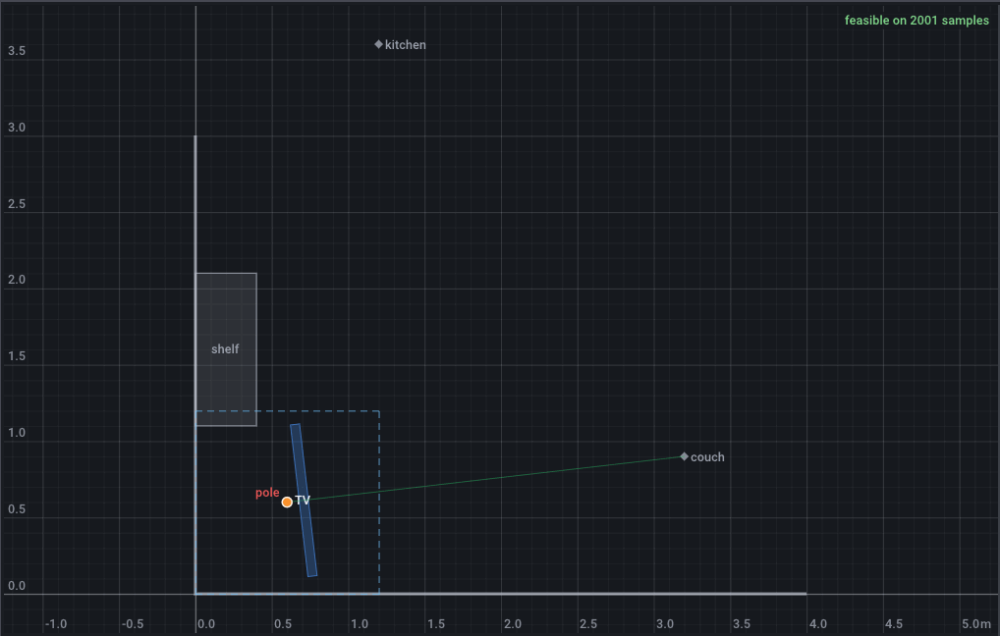
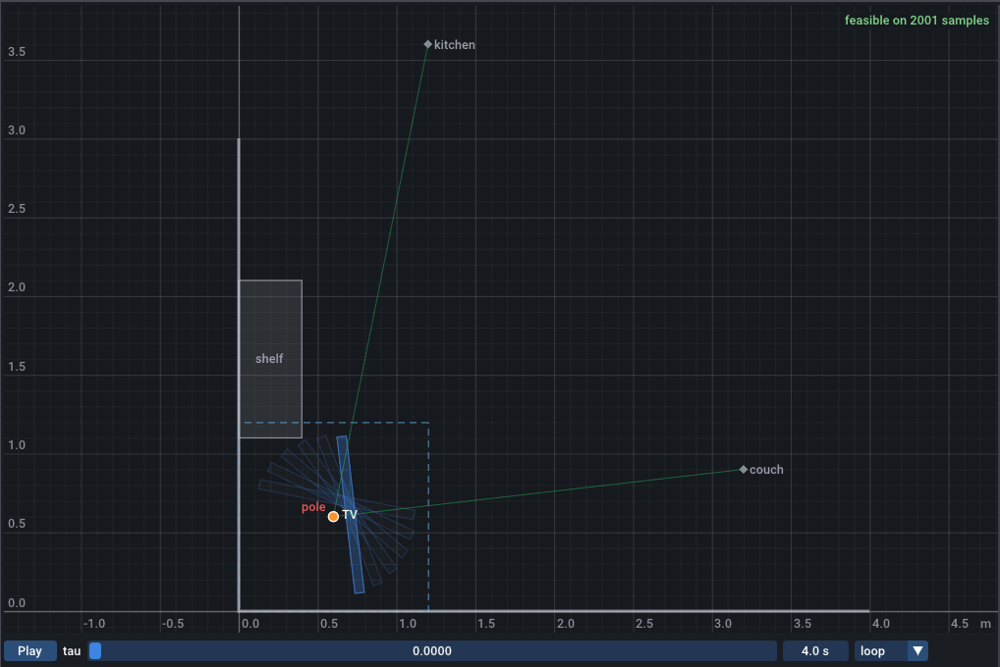

# Your first problem

In this tutorial you write an instance file from scratch and solve it. The problem: a TV on a swivel pole in the corner of a living room. It turns from facing the couch to facing the kitchen, and on its way it must not hit the two walls or a shelf. You want the widest TV that fits without reaching too far into the room, and the place of the pole that makes it fit.

The file grows in five steps, one section at a time. Each step shows the whole file with the new lines highlighted. The five files are in the repository as `docs/instances/start-tutorial-1.json` to `start-tutorial-5.json`; the commands below use them and run from the repository root. To follow along in your own file, copy each step into it and replace the path in the commands.

!!! note "Units"
    Everything inside the solver is SI: metres and radians. A number with a unit suffix, such as `6cm` or `90deg`, is converted when the file is read. A `unit` key never changes a value: it only chooses how the GUI and the CLI display it. [Units](../guide/instance-files.md#units) lists the suffixes.

## 1. Describe the room

An instance file is a JSON object. `format` is required and must be `geomsolver-instance/1`; `description` is free text. The `geometry` section holds the constant shapes of the scene, each with a name and a `type`:

- the two walls, as a `polyline` through three points, with the corner of the room at the origin;
- a `shelf` against the left wall, as a `rect` given by its centre, width, height and angle (in degrees);
- two `point`s: the eyes of a viewer on the couch, and where you stand in the kitchen.

```json title="Step 1: the room"
--8<-- "docs/instances/start-tutorial-1.json"
```

Check that the file loads and compiles:

```bash
./build/geomsolver-cli docs/instances/start-tutorial-1.json --eval
```

```text title="Output"
instance docs/instances/start-tutorial-1.json  (n = 0, 0 row groups, SLSQP)
design
criteria (2001 samples per sweep)
  name             role      value              bound / where
constraints (margin = -violation, natural units; VIOLATED when the violation exceeds 1e-07)
  name                           margin             status     worst at
summary: feasible yes (tol 1e-07)  max violation -inf (none)  objective 0
```

There is nothing to solve yet: `n = 0` means the solver has no coordinate to move. Open the file in the GUI to see the room:

```bash
./build/geomsolver docs/instances/start-tutorial-1.json
```


## 2. Add the design variables

The `design` section lists what the solver may change. This problem has two design variables:

- `P`, a `point`: the axis of the swivel pole. Its `domain` is the shape it must stay in, here `box(0, 0, 1.2, 1.2)`, the 1.2 m square in the corner.
- `W`, a `scalar`: the width of the TV, between `min` and `max`. Limits may be numbers or expressions with units.

`value` is the design the file starts from, always in SI: `"value": 1.0` is a 1 m wide TV, which the GUI and the CLI show as `100 cm` because of `"unit": "cm"`. `note` is a comment shown in the GUI.

The `params` section names constants: the depth of the TV and the arm between the pole axis and the back of the TV. The `let` section defines derived geometry from the params and the design variables. `tv` is the TV body, drawn in its own frame with the pole axis at the origin and the screen facing +y, then placed:

- `box(-W/2, arm, W/2, arm + depth)` is the body in that frame;
- `place(shape, P, a)` rotates the shape by `a` about the origin, then moves the origin to `P`;
- `angle(couch - P) - 90deg` turns the frame's +y axis towards the couch.

The `display` section lists what the GUI draws on top of the constant geometry: the TV, the pole, and the line from the pole to the couch.

```json title="Step 2: the TV and its pole" hl_lines="4-7 14-25"
--8<-- "docs/instances/start-tutorial-2.json"
```

```bash
./build/geomsolver-cli docs/instances/start-tutorial-2.json --eval
```

```text title="Output"
instance docs/instances/start-tutorial-2.json  (n = 3, 0 row groups, SLSQP)
design
  P          (0.6, 0.6) m
  W          100 cm
criteria (2001 samples per sweep)
  name             role      value              bound / where
constraints (margin = -violation, natural units; VIOLATED when the violation exceeds 1e-07)
  name                           margin             status     worst at
summary: feasible yes (tol 1e-07)  max violation -inf (none)  objective 0
```

`n = 3`: two coordinates for `P` and one for `W`. In the GUI, the pole is an orange handle and its domain a dashed square. Drag the handle: it stays inside the square. The `W` slider in the Inspector changes the width.



!!! tip
    The [design variables guide](../guide/design-variables.md) describes every kind of domain: segments, rectangles, polygons and circles.

## 3. Make the TV swivel

A sweep is a parameter of the motion. It is not a design variable: the solver does not choose it, and a constraint marked `forall` must hold at every one of its values. Add the sweep `tau`, from 0 (facing the couch) to 1 (facing the kitchen), and make the TV's heading depend on it:

- `h0` and `h1` are the directions from the pole to the couch and to the kitchen;
- `heading` goes from `h0` to `h1` as `tau` goes from 0 to 1;
- `tv` now rotates by `heading - 90deg`.

`"ghosts": 6` draws the TV at 6 evenly spaced values of `tau` as well, and a second line goes from the pole to the kitchen.

```json title="Step 3: the motion" hl_lines="18-20 22-25 28 31"
--8<-- "docs/instances/start-tutorial-3.json"
```

The GUI shows a slider for `tau` under the canvas. Drag it, or press Play to run the motion.



## 4. Add the constraints

A constraint is a relation that must hold: `a >= b`, `a <= b` or `a == b`. With `"forall": "tau"`, it must hold at every value of `tau`. Three constraints keep the TV `clr` (2 cm) away from the walls and the shelf:

- `min_x(tv) >= clr`: the smallest x of the TV body, so the gap to the left wall `x = 0`;
- `min_y(tv) >= clr`: the gap to the bottom wall `y = 0`;
- `clearance(tv, shelf) >= clr`: the distance between the TV and the shelf, negative when they overlap.

```json title="Step 4: the constraints" hl_lines="7 28-32"
--8<-- "docs/instances/start-tutorial-4.json"
```

```bash
./build/geomsolver-cli docs/instances/start-tutorial-4.json --eval
```

```text title="Output"
instance docs/instances/start-tutorial-4.json  (n = 3, 3 row groups, SLSQP)
design
  P          (0.6, 0.6) m
  W          100 cm
criteria (2001 samples per sweep)
  name             role      value              bound / where
constraints (margin = -violation, natural units; VIOLATED when the violation exceeds 1e-07)
  name                           margin             status     worst at
  wall_x                         0.105399           ok         tau=1
  wall_y                         0.09246546         ok         tau=0
  shelf                          -0.000713718       VIOLATED   tau=0.428
summary: feasible NO (tol 1e-07)  max violation 0.000713718 (shelf at tau=0.428)  objective 0
```

The check evaluates every for-all constraint on 2001 values of `tau`. The margin is how much room is left before the relation breaks, in the constraint's natural unit, metres here. The starting design comes 0.71 mm closer to the shelf than the 2 cm it must keep, at `tau = 0.428`. Its margins to the walls are 10.5 and 9.2 cm.

In the GUI, drag the `tau` slider to about 0.43. The canvas gets a red frame and a "Violated here" box, the Inspector marks the `shelf` constraint `[here]`, and the Margins tab plots each margin against `tau`.

![The GUI with step 4 loaded and the tau slider at 0.4344. The canvas has a red frame and a "Violated here (natural units)" box listing "shelf: 0.000233"; the end of the TV passes next to the lower right corner of the shelf. The Inspector shows wall_x and wall_y with green margins and shelf in red as "violated 0.000714 at tau=0.4280 [here]". The Margins plot at the bottom shows the shelf curve dipping to zero near tau = 0.43, at the white vertical line.](../assets/screenshots/start-tutorial-violated.png)

!!! warning
    A constraint that depends on a sweep must say which sweep it holds for. Without `"forall": "tau"`, the `shelf` constraint is a compile error:

    ```text
    constraints[2].expr at column 0: depends on sweep 'tau': add "forall": "tau", wrap it in max_over/min_over, or fix the sweep with at()
    ```

## 5. Add the criteria

Criteria are the quantities you optimise, bound or watch. Each has a `role`:

- `width`, with role `maximize`, is the objective. An instance has at most one `minimize` or `maximize` criterion.
- `protrusion`, with role `max`, must stay at or below its `bound`, here the param `max_protrusion` (110 cm). It measures how far the TV reaches into the room: `max_proj(tv, dir(45deg))` is the largest projection of the TV body on the room's diagonal, and `max_over(tau, ...)` takes the largest value over the motion.

`"unit": "cm"` displays both in centimetres. A bounded criterion compiles to the same rows as a constraint, and it also shows its value in its unit, takes a new bound from the command line, and can be swept by a Pareto study (step 8).

```json title="Step 5: the criteria" hl_lines="8 34-37"
--8<-- "docs/instances/start-tutorial-5.json"
```

```bash
./build/geomsolver-cli docs/instances/start-tutorial-5.json --eval
```

```text title="Output"
instance docs/instances/start-tutorial-5.json  (n = 3, 4 row groups, SLSQP)
design
  P          (0.6, 0.6) m
  W          100 cm
criteria (2001 samples per sweep)
  name             role      value              bound / where
  width            maximize  100 cm             
  protrusion       max       126.8915 cm        <= 110 cm  VIOLATED  at tau=0
constraints (margin = -violation, natural units; VIOLATED when the violation exceeds 1e-07)
  name                           margin             status     worst at
  wall_x                         0.105399           ok         tau=1
  wall_y                         0.09246546         ok         tau=0
  shelf                          -0.000713718       VIOLATED   tau=0.428
  protrusion:bound               -16.89152 cm       VIOLATED   tau=0
summary: feasible NO (tol 1e-07)  max violation 0.168915 (protrusion:bound at tau=0)  objective 100 cm
```

The bound of `protrusion` is a fourth row group, `protrusion:bound`, with its margin in the criterion's unit. The starting design reaches 126.9 cm into the room, 16.9 cm more than allowed.

!!! warning
    `max_proj(tv, dir(45deg))` alone depends on `tau`, and a criterion has no `forall`. Without `max_over`, the criterion is a compile error:

    ```text
    criteria[1].expr at column 0: depends on sweep 'tau': wrap it in max_over(tau, ...) / min_over(tau, ...) or fix the sweep with at()
    ```

## 6. Solve

Run the CLI without `--eval` to solve:

```bash
./build/geomsolver-cli docs/instances/start-tutorial-5.json
```

```text title="Output"
instance docs/instances/start-tutorial-5.json  (n = 3, 4 row groups, SLSQP)
65 of 65 runs finished, 65 feasible, 1 distinct solutions, 0.01 s on 16 threads
  #    objective          feasible  max viol     hits  variants  best run           exchange (iterations, samples)
  1    98.81456 cm        yes       4.63e-12     65    1         59 (uniform 58)    converged (1, 5)

best solution (run 59, uniform 58)
design
  P          (0.4834015, 0.4969842) m
  W          98.81456 cm
criteria (2001 samples per sweep)
  name             role      value              bound / where
  width            maximize  98.81456 cm        
  protrusion       max       110 cm             <= 110 cm  ok  at tau=0
constraints (margin = -violation, natural units; VIOLATED when the violation exceeds 1e-07)
  name                           margin             status     worst at
  wall_x                         -4.250315e-13      ok         tau=1
  wall_y                         -6.581229e-13      ok         tau=0
  shelf                          0.07523096         ok         tau=0.2225
  protrusion:bound               -4.63074e-10 cm    ok         tau=0
summary: feasible yes (tol 1e-07)  max violation 4.63074e-12 (protrusion:bound at tau=0)  objective 98.81456 cm
```

The solver ran 65 times: once from the design in the file, and once from each of 64 seeded random starts. All 65 runs ended at the same design (`hits`), so there is one distinct solution. The widest TV is 98.81456 cm, with the pole at (0.4834015, 0.4969842) m.

Read the margins to see what limits it. `protrusion` sits exactly at its 110 cm bound, and `wall_x` and `wall_y` have margins of the order of 1e-13 m, zero up to rounding: the TV keeps exactly 2 cm from the left wall when it faces the kitchen (`tau=1`) and from the bottom wall when it faces the couch (`tau=0`). The `shelf` margin is 7.5 cm: the shelf does not limit this design. The exit status is 0 because a feasible solution exists. The time and the number of threads in the second line depend on your machine.

`converged (1, 5)` describes the sampling of the for-all constraints: the solver worked with 5 values of `tau`, and the check on 2001 values found nothing to add.

## 7. Solve in the GUI

Open the final file:

```bash
./build/geomsolver docs/instances/start-tutorial-5.json
```

In the Solver tab, press Solve. The Solutions table lists the distinct solutions, feasible first and best first. Click a row to load its design into the editor. The document is then marked modified, and File > Save (<kbd>Ctrl+S</kbd>) writes the design values into the `value` keys of the file.


## 8. Explore the trade-off

The 110 cm bound is a choice. A Pareto study answers the next question, "how much wider could the TV be if it reached further into the room?", by solving again for a list of bounds:

```bash
./build/geomsolver-cli docs/instances/start-tutorial-5.json --pareto protrusion --bounds 90,100,110,120,130,140
```

```text title="Output (first lines)"
instance docs/instances/start-tutorial-5.json  (n = 3, 4 row groups, SLSQP)
pareto study: bound of protrusion (6 points, 0.02 s)
  bound          objective          feasible  hits / runs
  90 cm          79.92019 cm        yes       9 / 9
  100 cm         89.44112 cm        yes       10 / 10
  110 cm         98.81456 cm        yes       10 / 10
  120 cm         107.4175 cm        yes       10 / 10
  130 cm         111.0631 cm        yes       10 / 10
  140 cm         115.8879 cm        yes       10 / 10
```

The bounds are in the criterion's display unit, centimetres. Up to 120 cm, each extra 10 cm of protrusion buys 8.6 to 9.5 cm of width. From 120 to 130 cm it buys 3.6 cm: on its way to the kitchen, the TV now passes exactly 2 cm from the shelf, which becomes the limit. With the bound at 120 cm (`--bound protrusion=120`), the `shelf` margin is zero and the `wall_x` margin is 0.94 cm.

In the GUI, open the Pareto study section of the Solver tab, choose `protrusion`, type the bounds and press Run Pareto study. Click a point of the plot to load its design.


To keep one point, save it as an instance: `--write-instance` writes the file with that point's design values and its bound.

```bash
./build/geomsolver-cli docs/instances/start-tutorial-5.json --pareto protrusion --bounds 90,100,110,120,130,140 --write-instance tv_120.json --write-point 4
```

```text title="Output (last line)"
instance with the best design (2 variables; bounds protrusion <= 120cm) written to tv_120.json
```

## Next steps

- [The GUI](gui.md) describes every panel of the window.
- [The command line](cli.md) covers the other ways to run the solver: polishing, fixing variables, overriding bounds and params, probes and result files.
- The [modelling guide](../guide/index.md) explains each section of an instance in depth, starting with [design variables](../guide/design-variables.md), [sweeps](../guide/sweeps.md) and [constraints](../guide/constraints.md).
- The [corner TV example](../examples/tv-corner.md) solves the same kind of problem with a four-bar linkage instead of a pole.
