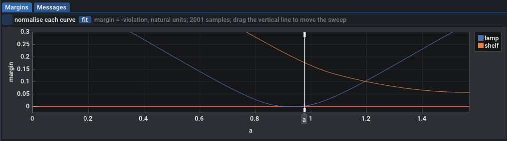
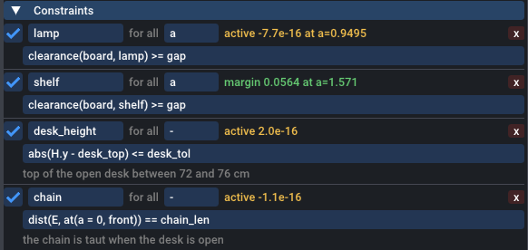

# Constraints

A constraint is a relation that every acceptable design must satisfy: the board clears the lamp, the hinge stays between two heights, the chain is taut. The solver never trades a constraint against the objective. A design that violates one by more than the feasibility tolerance is infeasible, whatever its objective.

This page uses one running example, a fold-up wall desk seen from the side. The wall is the line x = 0 and the floor y = 0. The board hinges at `H` on the wall and folds up from open (`a = 0`) to flat against the wall (`a = 90deg`). On the way it passes a wall lamp, and folded it must fit under a shelf. A chain from a wall anchor `E` holds the open desk. The goal is the deepest board.

```json title="docs/instances/guide-b-desk.json"
--8<-- "docs/instances/guide-b-desk.json"
```

Solve it with:

```bash
build/geomsolver-cli docs/instances/guide-b-desk.json
```

The best design has `H = (0, 0.72)`, `w = 64.36129 cm` and `E = (0, 1.349097)`. The constraints table of the output reads:

```text title="geomsolver-cli output (excerpt)"
constraints (margin = -violation, natural units; VIOLATED when the violation exceeds 1e-07)
  name                           margin             status     worst at
  lamp                           -7.684825e-16      ok         a=0.949546
  shelf                          0.05638714         ok         a=1.5708
  desk_height                    2.046974e-16       ok         
  chain                          -1.110223e-16      ok         
summary: feasible yes (tol 1e-07)  max violation 7.68482e-16 (lamp at a=0.949546)  objective 64.36129 cm
```

The board's lower front corner grazes the lamp at a = 0.949546 rad (54.4°), and the hinge sits at the lowest allowed height. You can check the result by hand: the corner swings on a circle of radius √(w² + t²) around `H`, which must stop `gap` short of the lamp, so w = √((|H − lamp centre| − r − gap)² − t²) = 0.643613 m.

## Anatomy of a constraint

`constraints` is a list. Each entry is an object with these keys:

| Key | Required | Meaning |
| --- | --- | --- |
| **`name`** | yes | Identifies the constraint in the GUI, the CLI output and the results file. Names must be unique among constraints. |
| **`expr`** | yes | A relation between two scalar expressions: `<=`, `>=` or `==`. |
| **`forall`** | no | The name of a sweep. The relation must then hold at every value of that sweep. |
| **`enabled`** | no | `false` keeps the constraint in the file but adds nothing to the problem. Default `true`. |
| **`note`** | no | Free text, shown under the constraint in the Inspector. |

Any other key gets a warning and is ignored. A `unit` key gets its own warning, because a constraint has no display unit (see [Constraint or bounded criterion?](#constraint-or-bounded-criterion)).

## 1. Write the relation

The expression is two scalar sides joined by one comparison:

- `a <= b` and `a >= b` are inequalities. `<` and `>` are accepted and mean the same as `<=` and `>=`: a numerical solver cannot enforce a strict inequality.
- `a == b` is an equality (see [Equality constraints](#equality-constraints)).

Each side can be any scalar expression: a measure such as `clearance(board, lamp)`, a coordinate such as `H.y`, a param, a number with a unit such as `72cm`. Both sides are in SI units, whatever unit suffix you typed.

Only one comparison is allowed, at the top level. `72cm <= H.y <= 76cm` is an error (`only one comparison is allowed`); write a two-sided limit as an `abs()` bound or as two constraints (see [Splitting `abs()`](#splitting-abs)).

The solver turns each relation into a row g ≤ 0: `lhs <= rhs` becomes g = lhs − rhs, and `lhs >= rhs` becomes g = rhs − lhs. The **margin** printed by the CLI and the GUI is −g, in the natural unit of the expression (metres, radians, or no unit). A positive margin is room to spare; a negative margin is a violation. A design is feasible when no row is violated by more than `feas_tol`, 1e-7 by default, in that unit.

!!! tip
    Put the measured quantity on the left and the limit on the right, and keep the limit in a param: `clearance(board, lamp) >= gap`. The margin then reads as "how much more than `gap`", and you change the limit in one place.

## 2. Decide when it must hold

A relation that involves no sweep holds once, for the design. `desk_height` and `chain` are such constraints.

A relation that depends on a sweep must say which values of the sweep it applies to. There are three ways:

| Form | Meaning | Example |
| --- | --- | --- |
| **`"forall": "a"`** | at every value of `a` | `{"name": "lamp", "forall": "a", "expr": "clearance(board, lamp) >= gap"}` |
| **`at(a = value, ...)`** | at one value of `a`, which may be a design variable | `dist(E, at(a = 0, front)) == chain_len` |
| **`max_over(a, ...) <= b`** | the worst case over `a`, written as a side | `max_over(a, max_y(board)) <= 1.42` |

`forall` and the `max_over` form compile to the same rows. On the desk, replacing `lamp` and `shelf` with the single row `max_over(a, max_y(board)) <= 1.42` gives the 70 cm board of the shelf alone. `max_over` and `min_over` are only allowed as a whole side of a constraint, never together with `forall`, and only in the directions that mean "at every value": `max_over(s, f) <= b` and `min_over(s, f) >= b`, either way round. Against a plain side `b`, the opposite directions mean "at one value" and are compile errors. Between two aggregates, every direction compiles, without a warning, and a side that asks for "at one value" is then only checked on the solver's samples. The [aggregate table](sweeps.md#aggregates) lists every form, and the [witness](sweeps.md#witnesses) is how to ask for "at one value".

A side that depends on a sweep without any of the three forms is an error:

```text
constraints[0].expr at column 0: depends on sweep 'a': add "forall": "a", wrap it in max_over/min_over, or fix the sweep with at()
```

A `forall` on a relation that does not depend on that sweep gets a warning, since it has no effect.

### How the solver checks a for-all constraint

A for-all constraint is a row per sample of the sweep. The solver starts with 5 evenly spaced samples, solves, then checks the design on a fine grid of 2001 values. Each violated constraint gets its worst grid value added as a new sample, and the solve resumes from where it stopped. On the desk this converges with 7 samples of `a`: the 5 initial ones plus two near 54°, where the lamp is closest. The [sweeps page](sweeps.md) has the details.

The **worst at** column is the sweep value, in SI units (radians for `a`), where the constraint has its smallest margin on the fine grid. The Margins tab of the GUI plots the margin of every for-all constraint against the sweep:



## 3. Read the status

The Inspector shows every constraint with its fine-grid status. A constraint at its limit is **active**: the solver pushed the design against it, and relaxing it can improve the objective. Here `lamp`, `desk_height` and `chain` are active and `shelf` has 5.6 cm to spare in the folded pose:



To see what an active constraint costs, disable it and solve again. You do not need to edit the file:

```bash
build/geomsolver-cli docs/instances/guide-b-desk.json --set 'constraints[0].enabled=false'
```

Without `lamp`, the board grows to 70 cm and the shelf becomes the limit: folded, the board top reaches 0.72 + 0.70 = 1.42 m, one `gap` below the shelf. A disabled constraint is still parsed and checked for errors, but it adds no row: it is missing from the output table, and the header counts 3 row groups instead of 4. In the GUI, the checkbox in front of the constraint does the same.

## Splitting `abs()`

`desk_height` keeps the hinge, which is the top of the open desk, between 72 and 76 cm:

```json title="docs/instances/guide-b-desk.json (constraints)"
--8<-- "docs/instances/guide-b-desk.json:32:32"
```

When one side of an inequality is a bare `abs(e)` and that side must be the smaller one (`abs(e) <= b`, or `b >= abs(e)`), the compiler splits it into two rows, e − b ≤ 0 and −e − b ≤ 0. Each row is smooth, so the solver sees the true slopes on both sides instead of the kink of `abs` at e = 0. This is the natural way to write a two-sided limit around a centre value.

The split only applies to a top-level `abs`:

- `abs(H.y - desk_top) <= desk_tol` is split.
- `abs(H.y - desk_top) - desk_tol <= 0` is not: the side is a subtraction, not an `abs`.
- `abs(e) == b` is not split.
- `abs(e) >= b` is not split. It asks e to stay out of a band around zero, which is two separate regions, and the row has a kink at e = 0. When phase 1 stalls at that kink, it retries twice from a perturbed point. If you know which side of the band the design belongs to, write `e >= b` or `e <= -b` instead.

## Equality constraints

`chain` makes the chain exactly as long as the distance from its anchor to the front edge of the open desk:

```json title="docs/instances/guide-b-desk.json (constraints)"
--8<-- "docs/instances/guide-b-desk.json:33:33"
```

An `==` relation becomes an equality row. SLSQP, the default algorithm, handles equality rows directly; phase 1, which looks for a feasible start, treats each one as the two inequalities g ≤ 0 and −g ≤ 0. The row counts as satisfied when |g| ≤ `feas_tol`. In the solved desk, the chain row is −1.1e-16 m.

Each equality removes one degree of freedom. Here the anchor `E` moves on a wall segment, so the chain equality pins it: `E` ends at 1.349097 m, where √(0.643613² + (1.349097 − 0.72)²) = 0.9 m. Without the equality, `E` is free and the solver reports the optimum with 35 variants, one per position of `E` that the runs ended at.

Use an equality when the physics really is one: a taut chain, two pivots on a common axis, a part that must touch a stop. Use an inequality when one direction is harmless, as with a clearance. An equality under `forall` needs the expression to stay constant over the whole motion, which few designs achieve.

!!! note
    `abs()` is not split in an equality, and an equality on an angle needs care: `angle()` jumps by 2π at ±180°. The [recipes](recipes.md#undirected-line-angle) show how to put two points on a line with `sin_between`, which has neither problem.

## Implicit rows

Some rows are added by the compiler. You do not write them and you cannot disable them. They appear in the CLI output like your own constraints, and those that depend on a sweep also appear in the Margins tab:

| Row group | Added when | Meaning |
| --- | --- | --- |
| **`assembly of p`** | a constraint, a bound or the objective uses a `dyad()`, here held by the let `p` | The two circles of the dyad intersect, so the linkage can be assembled. The margin is in metres: how far the circles are from no longer crossing. A dyad evaluated inside `at()` gets its own row, such as `assembly of p at tau=0` or `assembly of p at tau=tstar`. A dyad used only by a `report` criterion or a display item gets no row. |
| **`A in domain`** | a design point `A` has a polygon or circle domain that is not a parallelogram | The point lies in its domain. A parallelogram or segment domain needs no row: the point is mapped into it by construction. |

The corner-TV fixture, solved with `build/geomsolver-cli tests/data/tv_corner_ref.json`, has four assembly rows, all with room to spare:

```text title="geomsolver-cli output (excerpt)"
  assembly of p                  0.08309124         ok         tau=0.693
  assembly of p at tau=0         0.2442387          ok         
  assembly of p at tau=1         0.1274759          ok         
  assembly of p at tau=tstar     0.09223584         ok         
```

The [mechanisms page](let-and-mechanisms.md) explains where assembly rows come from, and the [design variables page](design-variables.md) explains membership rows.

## Common constraints

Every example below comes from a tested instance file.

### Clearance

`clearance(g1, g2)` is the signed distance between two shapes or points: positive for a gap, negative for the penetration depth when they overlap. It is exact for convex polygons, circles and points. A non-convex constant polygon is split into convex pieces, and the penetration into it is then a lower bound of the true depth.

```json title="docs/instances/guide-b-desk.json"
--8<-- "docs/instances/guide-b-desk.json:30:31"
```

```json title="tests/data/tv_corner_ref.json"
--8<-- "tests/data/tv_corner_ref.json:54:57"
```

A link is a segment, so a link clears a body with `clearance(segment(A, C), tv)`. In a linkage whose two links are interchangeable, constrain both; the [recipes](recipes.md#clearance-between-a-moving-body-and-the-links) show why.

!!! warning "A wall drawn as a line has no inside"
    The clearance to an open polyline is the distance to its nearest segment. A body that straddles the line gets a negative value, but a body that has gone all the way through gets a positive one, so `clearance(body, walls) >= gap` does not keep it in the room. Probed on the [tutorial](../getting-started/tutorial.md)'s room, whose `walls` run along x = 0 and y = 0:

    ```text title="geomsolver-cli docs/instances/start-tutorial-5.json --eval --probe ... (probes)"
      clearance(box(-1, 1, -0.5, 1.5), walls) = 0.5
      clearance(box(-0.2, 1, 0.3, 1.5), walls) = -0.2
      clearance(box(0.5, 1, 1, 1.5), walls) = 0.5
    ```

    The box behind the wall and the box 50 cm inside the room read the same. Keep a body on the room side of a wall with the containment rows below.

### Containment

To keep a moving shape on one side of a wall, bound its extreme coordinate. The corner TV writes its wall gaps as bounded criteria, so that they show in centimetres:

```json title="tests/data/tv_corner_ref.json (criteria)"
--8<-- "tests/data/tv_corner_ref.json:67:68"
```

`min_x`, `max_x`, `min_y` and `max_y` take several shapes and points at once. For a wall in any other direction, use `max_proj(g, n) <= c` or `min_proj(g, n) >= c`, where `n` is the wall's normal.

To keep a moving point inside a convex region, bound its clearance below zero. Inside a polygon the clearance is minus the distance to the boundary, so `<= -m` keeps the point at least `m` inside:

```json title="docs/instances/guide-b-tv-zone.json"
--8<-- "docs/instances/guide-b-tv-zone.json:61:61"
```

A design point needs no such row: give it the region as its [domain](design-variables.md). Any other point, a corner of a body or a seat placed in front of a desk, cannot have a domain, even when no sweep moves it, and needs the clearance row.

To keep a whole shape inside a convex region, write one such row per corner, `clearance(vertex(desk, i), room) <= -m`, and for a circle bound the clearance of its centre by `-(r + m)`. Or write one row per wall with `min_x`, `max_x`, `min_y`, `max_y` or `max_proj`. The [recipe](recipes.md#keep-a-shape-inside-a-region) solves a desk and its chair both ways.

!!! warning "Not `clearance(shape, region) <= -m`"
    Between two shapes that overlap, `clearance` is minus the penetration depth: how far one must move to separate them. A desk that crosses a wall still overlaps the room deeply, so this row accepts it. In the recipe's study room, it lets every run push the desk 70 cm through both side walls and report the design feasible.

### Distance

```json title="tests/data/tv_corner_ref.json"
--8<-- "tests/data/tv_corner_ref.json:58:59"
```

`dist(p, q)` is the length of `q − p`. The chain above is a distance equality.

### Angle and orientation

| Relation | Expression | Notes |
| --- | --- | --- |
| **Signed angle within a tolerance** | `abs(angle_between(u, v)) <= tol` | `angle_between` is signed, in (−π, π]: `angle_between(vec(1, 0), vec(0, 1))` is π/2. The `abs` is split. |
| **Two lines parallel** | `sin_between(u, v) == 0` | Ignores direction: `sin_between(vec(1, 1), vec(-1, -1))` is 0. |
| **Point on the left of a line** | `cross(B - A, P - A) >= 0` | `cross(u, v)` is positive when `v` turns counter-clockwise from `u`: `cross(vec(1, 0), vec(0, 1))` is 1. |
| **Facing away from a point** | `dot(n, p - q) >= 0` | `n` is a unit normal at `p`; the value is how far `q` lies behind the line through `p` with normal `n`. |

The corner TV keeps its screen facing away from the room corner at every pose:

```json title="docs/instances/guide-b-tv-zone.json"
--8<-- "docs/instances/guide-b-tv-zone.json:62:62"
```

and its wall pivots on a line at −35°:

```json title="docs/instances/guide-b-tv-links.json"
--8<-- "docs/instances/guide-b-tv-links.json:64:64"
```

The view angles of the corner TV are `abs(angle_between(...))` bounds, written as criteria; see the [recipes](recipes.md#face-a-target-within-a-tolerance).

## Constraint or bounded criterion?

A criterion with role `max` or `min` and a `bound` compiles to exactly the rows of the constraint `expr <= bound` or `expr >= bound`, including the `abs()` split for `max`. It adds:

- a display unit: the value, the bound and the margin show in `cm`, `deg` or `%` instead of SI;
- the value and its bound in the criteria tables of the GUI and the CLI;
- `--bound C=VALUE` on the command line, in the display unit, without editing the file;
- a [Pareto study](criteria.md#trade-offs-pareto-studies) over the bound.

| Write it as | When |
| --- | --- |
| **a constraint** | It is a plain physical requirement that you will not trade: no collision, an assembly condition, a chain that must be taut. Its margin in SI is enough. |
| **a `max` / `min` criterion** | The limit is a number you chose and might change: a tolerance, a length range, a view angle, a share of visible screen. You want it in a display unit, or you want to know what it costs. |

The corner TV follows this rule: its obstacle clearances and pivot spacings are constraints, while its view angles, link angle, wall gaps, link lengths and centring tolerances are criteria. The [criteria page](criteria.md) covers roles and bounds.

## Next steps

- [Criteria and objectives](criteria.md): the objective, bounded criteria and Pareto studies.
- [Recipes](recipes.md): tested constraints for common design requirements.
- [Troubleshooting](troubleshooting.md): reading error messages and diagnosing an infeasible problem.
