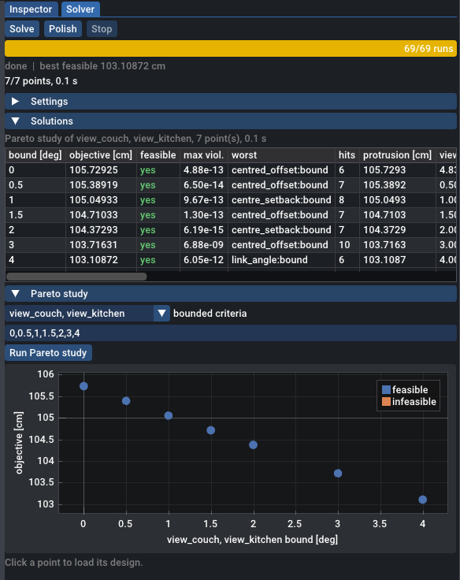

# Criteria and objectives

A criterion is a named scalar that the tool evaluates for every design and shows in its display unit. Its `role` says what the solver does with it: optimise it, keep it under or over a bound, or only report it. An instance has at most one objective; every other goal is a bounded criterion, and a Pareto study shows what each bound costs.

The examples on this page come from the corner-TV fixture, `tests/data/tv_corner_ref.json`, and from two small instances written for this page. The fixture's criteria are:

```json title="tests/data/tv_corner_ref.json (criteria)"
--8<-- "tests/data/tv_corner_ref.json:61:76"
```

## Anatomy of a criterion

| Key | Required | Meaning |
| --- | --- | --- |
| **`name`** | yes | Identifies the criterion in the GUI, the CLI output, `--bound`, `--pareto` and the results file. Names must be unique among criteria. |
| **`expr`** | yes | A scalar expression. Not a comparison: `w >= 0.5` is an error that asks for `role` and `bound` instead. |
| **`role`** | yes | `minimize`, `maximize`, `max`, `min` or `report`. |
| **`bound`** | for `max` and `min` | A number in SI units or a constant expression, usually a param name. |
| **`unit`** | no | Display unit: `deg`, `rad`, `m`, `cm`, `mm` or `%`. |
| **`note`** | no | Free text. |

Any other key gets a warning and is ignored. A `bound` on a role that has none gets a warning too. The former `weight` key is an error (see [Why bounds and not weights](#why-bounds-and-not-weights)).

## Roles

| Role | What the solver does | Example |
| --- | --- | --- |
| **`minimize`** | Makes the value as small as possible. | the fixture's `protrusion` |
| **`maximize`** | Makes the value as large as possible. | `depth` of the desk on the [constraints page](constraints.md) |
| **`max`** | Keeps the value at most `bound`: the same row as the constraint `expr <= bound`. | the fixture's `view_couch`, `link_1` |
| **`min`** | Keeps the value at least `bound`: the same row as the constraint `expr >= bound`. | the fixture's `kitchen_visible`, `link_angle` |
| **`report`** | Nothing. The value is only shown. | |

`minimize` and `maximize` make the criterion the **objective**. A second one is an error:

```text
criteria[1].role: a second objective (the first is criteria[0]): an instance has one "minimize" or "maximize" criterion. Bound the others (role "max" / "min") and run a Pareto study over their bounds, or write the sum you want in one expression
```

An instance without an objective is a feasibility problem: the solver looks for designs that satisfy every row and reports an objective of 0. Turning the desk's `depth` into a report (`--set 'criteria[0].role=report'`) gives 16 feasible runs, clustered as one solution with 8 variants, because nothing makes one feasible design better than another.

A `report` criterion takes no part in the solve: when it evaluates to NaN it shows as n/a, and the design is judged on its rows alone.

## Bounds

Write the bound as a param name rather than a number:

```json title="tests/data/tv_corner_ref.json"
--8<-- "tests/data/tv_corner_ref.json:14:14"
```

```json title="tests/data/tv_corner_ref.json (criteria)"
--8<-- "tests/data/tv_corner_ref.json:63:64"
```

The bound is in SI units like every expression, so `"2deg"` is 0.0349 rad. A param shared by several criteria moves them together; `--bound` moves one. On the fixture:

| Command | `view_couch` | `view_kitchen` | protrusion |
| --- | --- | --- | --- |
| **`geomsolver-cli tests/data/tv_corner_ref.json`** | ≤ 2° | ≤ 2° | 104.3729 cm |
| **`... --bound view_couch=1`** | ≤ 1° | ≤ 2° | 104.6159 cm |
| **`... --set params.view_tol=1deg`** | ≤ 1° | ≤ 1° | 105.0493 cm |

`--bound C=VALUE` takes the value in the criterion's display unit, so `--bound view_couch=1` means 1°, and `--bound kitchen_visible=84` means 0.84. `--set` takes the JSON value, here a string with a unit suffix.

!!! tip
    `--write-instance out.json` saves the instance with the best design and the bounds it was solved under: after `--bound view_couch=1`, the written criterion has `"bound": "1deg"`. Your own file is never modified.

### A two-sided bound

A quantity with a lower and an upper limit takes two criteria, one `max` and one `min`, like the fixture's link lengths:

```json title="tests/data/tv_corner_ref.json (criteria)"
--8<-- "tests/data/tv_corner_ref.json:69:72"
```

For a tolerance around a centre value, a single `max` criterion on `abs()` is enough: as in a constraint, a top-level `abs(e)` under role `max` is split into two smooth rows. The fixture's `view_couch`, `view_kitchen`, `centred_offset` and `centred_angle` are written this way. A `min` criterion on `abs()` is not split.

## Display units

`unit` changes how the value, the bound and the bound's margin are shown, never the value itself. Expressions and bounds stay in SI. With `"unit": "%"`, the fixture's `kitchen_visible` reads `85.80526 % >= 86 %` for the hand design; without it, `0.8580526 >= 0.86`.

The CLI prints criteria in their units, and the bound rows of the constraints table in the same units:

```text title="geomsolver-cli tests/data/tv_corner_ref.json --eval (excerpt)"
  view_couch       max       9.524704 deg       <= 2 deg  VIOLATED
  kitchen_visible  min       85.80526 %         >= 86 %  VIOLATED
...
  view_couch:bound               -7.524704 deg      VIOLATED   
  kitchen_visible:bound          -0.194737 %        VIOLATED   
```

A bounded criterion's row group is named after it with `:bound`. An invalid unit is a schema error that lists the allowed ones.

In the GUI, each criterion shows its value in its unit, coloured green when its bound has room, amber when the bound is active and red when it is violated. The role, bound and unit have editors under the name:


Switching a criterion to a role without a bound removes its bound; switching back to `max` or `min` in the same session restores it, and a criterion that never had one starts from its current value.

## Worst cases over a motion

A criterion that depends on a sweep must say which value of the sweep it is about: either one pose with `at()`, or the worst case with `max_over` or `min_over` as the whole expression. Four pairings of role and aggregate do that:

- **`max` on `max_over(s, f)`**: f ≤ bound at every value of s, the rows of a for-all constraint.
- **`min` on `min_over(s, f)`**: f ≥ bound at every value of s. The fixture's `link_angle`, `wall_x` and `wall_y`.
- **`minimize max_over(s, f)`**: the smallest worst case. The fixture's `protrusion`.
- **`maximize min_over(s, f)`**: the largest worst case.

`max` on `min_over` and `min` on `max_over` ask for the bound at one sample only, and are compile errors that point you to a [witness](sweeps.md#witnesses): giving the fixture's `link_angle` the role `max` (`--set 'criteria[4].role=max'`) is rejected with `criteria[4].expr at column 0: with role "max", min_over(tau, f) <= b only asks for f <= b at one of the solver's samples of 'tau', ...`. The [aggregate table](sweeps.md#aggregates) lists every pairing, including the best-case objectives.

### The epigraph objective

`minimize max_over(tau, e)` is not smooth: the worst pose changes as the design moves. The solver does not minimise it directly. It adds a variable z, a row e(tᵢ) ≤ z for each sample tᵢ of `tau`, and minimises z. For `maximize min_over(tau, e)` the rows are −e(tᵢ) ≤ z. The rows are smooth, and at the optimum z equals the worst case.

The samples are refined like those of a for-all constraint: when the fine grid finds a worse case than the samples by more than `feas_tol`, that grid value becomes a new sample and the solve resumes. The CLI shows where the worst case lies, for example `protrusion minimize 104.3729 cm at tau=0`.

The two other pairings, `minimize min_over` and `maximize max_over`, take the best sample's value instead, with no epigraph and no refinement of the samples.

## One objective

Two goals rarely have a common unit, and the trade between them is a decision you should see. The tool therefore takes one objective and expresses every other goal as a bound. To trade the goals off, sweep the bound in a Pareto study.

If a combined quantity is what you really want to optimise, such as the sum of two link lengths, write it as one expression. The `weight` key of older instances is an error:

```text
criteria[1].weight: "weight" is no longer supported: an instance has one objective. To maximise, use role "maximize" instead of a negative weight; to trade criteria off, bound all but one (role "max" / "min") and run a Pareto study, or write the weighted sum in one expression
```

## Trade-offs: Pareto studies

A Pareto study solves the instance once per bound value and lists the best objective for each. This is the epsilon-constraint method: one criterion is optimised while another is bounded, and the bound moves.

### From the command line

```bash
build/geomsolver-cli tests/data/tv_corner_ref.json --pareto view_couch,view_kitchen --bounds 0,1,2,4
```

```text title="output (excerpt)"
pareto study: bound of view_couch, view_kitchen (4 points, 0.07 s)
  bound          objective          feasible  hits / runs
  0 deg          105.7293 cm        yes       6 / 9
  1 deg          105.0493 cm        yes       8 / 10
  2 deg          104.3729 cm        yes       8 / 10
  4 deg          103.1087 cm        yes       9 / 10
```

- Every listed criterion gets each bound in turn. The criteria must have a bound role (`max` or `min`) and share a display unit; the bounds are in that unit.
- Each point runs `pareto_starts` (8) seeded starts, plus the previous point's best design and the instance's design: hence 9 runs for the first point and 10 for the others.
- `--bound` still applies to the criteria the study does not sweep.
- `--write-instance out.json --write-point K` saves the design of point K (1-based) with its bounds.

!!! warning "Check the hits before reading the front"
    Ten runs per point is enough for the fixture, not for every problem. A point with 1 hit, a point marked infeasible between feasible ones, or a front that does not move monotonically with the bound may simply have missed its optimum. On the [flap linkage](let-and-mechanisms.md#four-bar), `--pareto link_angle --bounds 5,10,15,20,25,30` finds each point from 10 deg on in 1 run of 10, and reports 25 deg as infeasible:

    | `link_angle` bound | default (`pareto_starts` 8) | `--set solver.pareto_starts=256` |
    | --- | --- | --- |
    | **5 deg** | 64.62076 cm, 4 / 9 | 64.62075 cm, 44 / 257 |
    | **10 deg** | 65.68445 cm, 1 / 10 | 65.68444 cm, 29 / 258 |
    | **15 deg** | 66.28354 cm, 1 / 10 | 66.28353 cm, 30 / 258 |
    | **20 deg** | 66.95653 cm, 1 / 10 | 66.95653 cm, 10 / 258 |
    | **25 deg** | infeasible, 1 / 10 | 80.06378 cm, 7 / 258 |
    | **30 deg** | 83.80354 cm, 1 / 10 | 83.80354 cm, 3 / 258 |

    Raise `solver.pareto_starts` for a linkage, or confirm a doubtful point with a full multistart: `--bound link_angle=25` finds no feasible run in 65, `--bound link_angle=25 --starts 256` finds 6, at 80.06378 cm.

The visibility study of the fixture shows a rising marginal cost:

```bash
build/geomsolver-cli tests/data/tv_corner_ref.json --pareto kitchen_visible --bounds 0,80,84,86,88
```

| `kitchen_visible` bound | protrusion |
| --- | --- |
| **0 %** | 97.90595 cm |
| **80 %** | 98.63135 cm |
| **84 %** | 102.2104 cm |
| **86 %** | 104.3729 cm |
| **88 %** | 108.2699 cm |

### From the GUI

In the Solver tab, open **Pareto study**:

1. Pick one or more bounded criteria that share a unit.
2. Type the bounds in that unit, separated by commas.
3. Click **Run Pareto study**.

The Solutions table lists one row per point with every criterion, and the plot shows the objective against the bound. Click a point to load its design. The same study can be started from the command line with `geomsolver tests/data/tv_corner_ref.json --pareto view_couch,view_kitchen --bounds 0,0.5,1,1.5,2,3,4 --tab solver`:



## Why bounds and not weights

A weighted sum of two criteria can only reach the points of the trade-off curve that lie on its convex hull. Where the curve is concave, every weighting jumps over it to an end. A bound reaches every point.

The two instances below make this concrete. A lamp `P` stands in the corner of a room. It must stay 1 m away from the corner, and you want it close to both walls: you minimise both `P.x` and `P.y`. The trade-off curve is the quarter circle x² + y² = 1, which bulges away from the ideal point (0, 0): it is concave.

=== "Weighted sum"

    ```json title="docs/instances/guide-b-front-weighted.json"
    --8<-- "docs/instances/guide-b-front-weighted.json"
    ```

=== "Bounded criterion"

    ```json title="docs/instances/guide-b-front-bounded.json"
    --8<-- "docs/instances/guide-b-front-bounded.json"
    ```

The weighted instance, solved with `--set params.wx=...` for weights from 0.1 to 0.9, only ever returns an end of the curve:

| `wx` | `P` | `P.x` | `P.y` |
| --- | --- | --- | --- |
| **0.1, 0.2, 0.3, 0.4, 0.45** | (1, 0) | 100 cm | 0 cm |
| **0.55, 0.6, 0.7, 0.8, 0.9** | (0, 1) | 0 cm | 100 cm |

The bounded instance traces the whole curve:

```bash
build/geomsolver-cli docs/instances/guide-b-front-bounded.json --pareto wall_y --bounds 0,20,40,60,80,100
```

| `wall_y` bound | `wall_x` (objective) |
| --- | --- |
| **0 cm** | 100 cm |
| **20 cm** | 97.97959 cm |
| **40 cm** | 91.65151 cm |
| **60 cm** | 80 cm |
| **80 cm** | 60 cm |
| **100 cm** | 0 cm |

Each value is √(1 − y²) to the printed digits. A bound also says what you mean in the criterion's own unit, "the lamp at most 50 cm from the wall", instead of an exchange rate between two units.

## Next steps

- [Constraints](constraints.md): relations that every design must satisfy.
- [Sweeps and motion](sweeps.md): `at()`, `max_over`, `min_over` and witness variables.
- [Recipes](recipes.md): tested criteria for view angles, visibility, protrusion and link angles.
- [Solver settings](../reference/solver-settings.md): `pareto_starts` and the other keys of the `solver` object.
