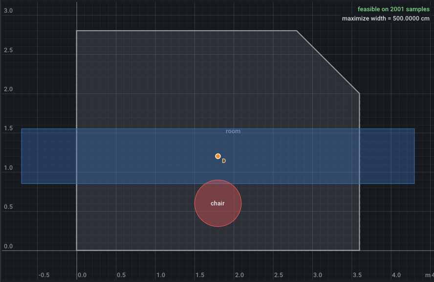

# Recipes

Each recipe below states a design requirement, the lines that express it, and what they do to the solution. Every snippet is included from an instance file that the documentation tests: the frozen corner-TV fixture `tests/data/tv_corner_ref.json`, or one of the variants written for these pages:

| File | What it adds to the fixture |
| --- | --- |
| **`docs/instances/guide-b-tv-links.json`** | A clearance between each link and the TV body, and the wall pivots on a line at −35°. |
| **`docs/instances/guide-b-tv-zone.json`** | The wall pivots in a triangular zone, the TV body's centre kept over the cabinet, the screen facing away from the corner. |
| **`docs/instances/guide-b-desk.json`** | The fold-up desk of the [constraints page](constraints.md). |
| **`docs/instances/guide-b-study.json`** | A desk and its chair in a study room, for [keeping a shape inside a region](#keep-a-shape-inside-a-region). |

Both TV variants include the fixture's frozen room, `tests/data/example_room_ref.json`. Run any command below from the repository root. The fixture alone solves to a protrusion of 104.3729 cm; that is the reference the results are compared with.

## Clearance between a moving body and the links

**Goal:** neither link touches the TV body during the swing.

```json title="docs/instances/guide-b-tv-links.json (constraints)"
--8<-- "docs/instances/guide-b-tv-links.json:62:63"
```

A link is the segment between its pivots, so `clearance(segment(A, C), tv)` is the gap between link 1 and the TV body. Constrain **both** links. In a four-bar, the pairs (`A`, `c`) and (`B`, `d`) play the same role: swapping the labels gives the same linkage, which is why the fixture's optimum has 2 variants, the design and its relabelled copy. Constrain one link only, and the solver keeps the labelling in which that link is clear, while the other one still goes through the TV. [Label symmetry](let-and-mechanisms.md#pitfalls) explains why.

Measured with `pivot_axis` disabled (`--set 'constraints[8].enabled=false'`), and the gaps reported by two extra `report` criteria `min_over(tau, clearance(segment(A, C), tv))` and the same for `B`, `D`:

| Constrained | Protrusion | Gap of link 1 | Gap of link 2 | Runs at the optimum |
| --- | --- | --- | --- | --- |
| **neither** (also disable `constraints[6]` and `[7]`) | 104.3729 cm | −5.730608 cm | 8.347213 cm | 51, 2 variants |
| **link 1 only** (also disable `constraints[7]`) | 104.3729 cm | 8.347213 cm | −5.730608 cm | 19, 1 variant |
| **both** | 107.5469 cm | 2.499999 cm | 7.309056 cm | 49, 2 variants |

With link 1 only, the optimum does not move: link 2 now crosses the TV by 5.73 cm instead of link 1. Constraining both links costs 3.17 cm of protrusion.

??? example "The command for the link 1 only row"

    ```bash
    build/geomsolver-cli docs/instances/guide-b-tv-links.json \
        --set 'constraints[7].enabled=false' --set 'constraints[8].enabled=false' \
        --set 'criteria[14]={"name": "gap1", "expr": "min_over(tau, clearance(segment(A, C), tv))", "role": "report", "unit": "cm"}' \
        --set 'criteria[15]={"name": "gap2", "expr": "min_over(tau, clearance(segment(B, D), tv))", "role": "report", "unit": "cm"}'
    ```

    The instance has 14 criteria, so `criteria[14]` and `criteria[15]` append two new ones.

!!! tip
    The same holds for any requirement on one side of a symmetric linkage: a pivot zone, a length range, a clearance. Write it for both sides, as the fixture does with `link_1` and `link_2`, or break the symmetry on purpose. Adding the constraint `A.y >= B.y` to the link 1 only run makes `A` the upper pivot, so the solver can no longer swap the labels: the optimum becomes 107.5469 cm, the same as with both links constrained.

## Keep a point in a region

**Goal:** a point stays inside a polygon.

A point that is a design variable takes the region as its domain. In the zone variant, both wall pivots must lie in a triangle along the corner:

```json title="docs/instances/guide-b-tv-zone.json (design)"
--8<-- "docs/instances/guide-b-tv-zone.json:22:23"
```

A triangle is not a parallelogram, so each point gets an implicit membership row, `A in domain` and `B in domain` in the output. At the optimum, `A` = (0.03, 0.2885969) sits on the triangle's wall-side edge and `B` = (0.45, 0.03) on its far corner: both membership margins are zero to rounding (0 and −5.6e-17 m).

A point that moves with a sweep, or any point computed from design variables, cannot have a domain: domains belong to design variables and are constant. Bound its clearance to the region instead: inside a convex polygon, `clearance` is minus the distance to the boundary, so `<= -m` keeps the point at least `m` inside. The zone variant keeps the centre of the TV body 9 cm inside the cabinet's outline at every pose:

```json title="docs/instances/guide-b-tv-zone.json"
--8<-- "docs/instances/guide-b-tv-zone.json:19:19"
```

```json title="docs/instances/guide-b-tv-zone.json (constraints)"
--8<-- "docs/instances/guide-b-tv-zone.json:61:61"
```

`build/geomsolver-cli docs/instances/guide-b-tv-zone.json` gives 104.4485 cm, with `over_cabinet` active at tau = 0.4385. With `over_margin` at 5 cm, or with the constraint disabled, the optimum is 104.3078 cm and the centre stays 8.2 cm inside on its own.

!!! warning
    For a non-convex region, `clearance` splits the polygon into convex pieces, and the depth inside it is a lower bound of the true depth. The constraint is then safe but conservative near the internal edges between pieces. Prefer convex regions, or several constraints.

## Keep a shape inside a region

**Goal:** a whole body, not only one of its points, stays inside a room or a zone.

This instance looks for the widest desk that fits, with its chair, in a study room whose top right corner is cut off. The desk is a `rect` around the design point `D`, at the angle `da`; the chair is a circle in front of it:

```json title="docs/instances/guide-b-study.json"
--8<-- "docs/instances/guide-b-study.json"
```

The domain of `D` keeps the desk's centre in the room, nothing more. The desk needs its own rows, one per corner. `vertex(desk, i)` is a point, and a point at least `gap` inside a convex polygon has a clearance of at most `-gap`:

```json title="docs/instances/guide-b-study.json (constraints)"
--8<-- "docs/instances/guide-b-study.json:24:28"
```

A circle is inside a convex region when its centre is at least its radius inside, hence `-(chair_r + gap)` for the chair's centre `seat`. A convex body is inside a convex region when all its corners are, so these five rows are enough.

`build/geomsolver-cli docs/instances/guide-b-study.json` gives a desk of 376.0904 cm, set across the room at −34.34995° with each corner `gap` from a different wall; the `chair_in` row has a margin of 0.554636 m. 10 of 65 runs reach it, and 71 of 513 with `--starts 512`, none better.


!!! warning "`clearance(shape, region) <= -m` does not keep a shape inside"
    Between two shapes that overlap, `clearance` is minus the penetration depth: how far one must move to separate them, not how deep one sits inside the other. A desk that crosses a wall still overlaps the room deeply. Replace the corner rows and the chair row with whole-shape clearances:

    ```bash
    build/geomsolver-cli docs/instances/guide-b-study.json --quiet \
        --set 'constraints[0].expr=clearance(desk, room) <= -gap' \
        --set 'constraints[1].enabled=false' --set 'constraints[2].enabled=false' \
        --set 'constraints[3].enabled=false' \
        --set 'constraints[4].expr=clearance(chair, room) <= -gap' \
        --probe 'min_x(desk)' --probe 'max_x(desk)'
    ```

    Every run then reaches the 500 cm limit of `Wd` and is reported feasible, with the desk from x = −0.7 to 4.3 m in a 3.6 m room:

    ```text title="output (excerpt)"
      1    500 cm             yes       -0.85        65    65        0 (current)        converged (1, 0)
    ...
      desk_in_0                      1.5                ok         
      chair_in                       0.85               ok         
    ...
    probes
      min_x(desk) = -0.7
      max_x(desk) = 4.3
    ```

    

    The same holds for a circle. Probed on this instance, a chair whose centre is 10 cm from the left wall, so that 20 cm of it is through the wall, gives `clearance(circle(vec(0.1, 1.4), chair_r), room)` = −0.4, as if it were 40 cm inside; `clearance(vec(0.1, 1.4), room)` = −0.1 shows where its centre really is.

When you know the walls, one row per wall does the same job. `min_x`, `max_x`, `min_y` and `max_y` take several shapes at once, circles included, and `max_proj(g, n)` measures along the outward normal `n` of a wall at any angle. For the study, the cut corner is the line x + y = 5.6, with normal `dir(45deg)`:

```bash
build/geomsolver-cli docs/instances/guide-b-study.json --quiet \
    --set 'constraints[0]={"name": "left", "expr": "min_x(desk, chair) >= gap"}' \
    --set 'constraints[1]={"name": "bottom", "expr": "min_y(desk, chair) >= gap"}' \
    --set 'constraints[2]={"name": "right", "expr": "max_x(desk, chair) <= 3.6 - gap"}' \
    --set 'constraints[3]={"name": "top", "expr": "max_y(desk, chair) <= 2.8 - gap"}' \
    --set 'constraints[4]={"name": "cut_desk", "expr": "max_proj(desk, dir(45deg)) <= 5.6 / sqrt(2) - gap"}' \
    --set 'constraints[5]={"name": "cut_chair", "expr": "max_proj(chair, dir(45deg)) <= 5.6 / sqrt(2) - gap"}'
```

It gives the same 376.0904 cm desk, with `left`, `bottom`, `right` and `top` active. The corner rows need no wall coordinates and follow the region if you change it; the wall rows give one readable margin per wall.

!!! note
    Corners inside do not keep a body inside a **non-convex** region: an edge can cut across a notch while every corner stays inside. Split such a region into convex parts and solve one instance per part, as the [design variables page](design-variables.md#charts) suggests for a point.

## Undirected line angle

**Goal:** two points lie on a line at a given angle, whichever comes first.

```json title="docs/instances/guide-b-tv-links.json"
--8<-- "docs/instances/guide-b-tv-links.json:20:20"
```

```json title="docs/instances/guide-b-tv-links.json (constraints)"
--8<-- "docs/instances/guide-b-tv-links.json:64:64"
```

`sin_between(u, v)` is the sine of the angle from `u` to `v`. It is zero when the two directions are parallel or opposite, so the equality holds whether `B` is down the axis from `A` or up it.

`angle(B - A) == pivot_axis_angle` looks equivalent but is not. `angle()` depends on the direction: the same line reads −45° as `angle(vec(1, -1))` and 135° as `angle(vec(-1, 1))`. In a symmetric linkage it therefore forbids one of the two labellings. It also jumps from π to −π across the negative x axis, so an axis near 180° puts a discontinuity in the row. Measured on the links variant with both link clearances disabled:

| `pivot_axis` written as | Protrusion | Runs at the optimum |
| --- | --- | --- |
| **`sin_between(B - A, dir(pivot_axis_angle)) == 0`** | 105.6282 cm | 57, 2 variants |
| **`angle(B - A) == pivot_axis_angle`** | 105.6282 cm | 52, 1 variant |

The optimum is the same here, but the `angle()` form lost the relabelled variant and five runs.

## Minimum distance between pivots

**Goal:** two pivots, or two bracket holes, stay at least a given distance apart.

```json title="tests/data/tv_corner_ref.json"
--8<-- "tests/data/tv_corner_ref.json:12:12"
```

```json title="tests/data/tv_corner_ref.json (constraints)"
--8<-- "tests/data/tv_corner_ref.json:58:59"
```

`c` and `d` are in the TV's own frame, so `dist(c, d)` is the spacing on the bracket and does not change with the motion. At the fixture's optimum both have room: the wall pivots are 43.3 cm apart and the bracket holes 28.6 cm, 33.3 cm and 18.6 cm more than `sep_min`.

## Face a target within a tolerance

**Goal:** in a given pose, a direction points at a target within a tolerance.

```json title="tests/data/tv_corner_ref.json"
--8<-- "tests/data/tv_corner_ref.json:14:14"
```

```json title="tests/data/tv_corner_ref.json (let)"
--8<-- "tests/data/tv_corner_ref.json:44:45"
```

```json title="tests/data/tv_corner_ref.json (criteria)"
--8<-- "tests/data/tv_corner_ref.json:64:64"
```

`angle_between(normal, kitchen_view - screen)` is the signed angle from the screen normal to the line of sight to the cook. `at(tau = 1, ...)` takes it in the kitchen pose, the end of the swing. The `abs()` under role `max` is split into two smooth rows, one per side. At the optimum the bound is active at 2°.

## Aim at a barycentre with `mean()`

**Goal:** aim at several viewers at once.

```json title="tests/data/tv_corner_ref.json (let)"
--8<-- "tests/data/tv_corner_ref.json:50:50"
```

```json title="tests/data/tv_corner_ref.json (criteria)"
--8<-- "tests/data/tv_corner_ref.json:63:63"
```

`mean(p1, p2, ...)` is the barycentre of its points; `center(chair1)` is the centre of the chair's circle. The couch pose aims at the point between the chair and the two seats, within `view_tol`. To favour one viewer, repeat that point in the list.

## Visibility past an occluder

**Goal:** most of the screen stays visible from a point, past an obstacle.

```json title="tests/data/tv_corner_ref.json (let)"
--8<-- "tests/data/tv_corner_ref.json:51:51"
```

```json title="tests/data/tv_corner_ref.json (criteria)"
--8<-- "tests/data/tv_corner_ref.json:65:65"
```

`visible_fraction(eye, target, occluder, ...)` is the share of the target's length, between 0 and 1, whose line of sight from `eye` crosses no occluder. The target is a segment or a polyline; here it is the screen's front face. Only what lies between the eye and the target hides it: an occluder behind the target, such as the TV's own body behind its screen face, would hide nothing.

With `"unit": "%"`, the bound reads as a percentage and `--bound kitchen_visible=84` means 84 %. The most visible feasible design, found by making the criterion the objective, sees 90.58655 % of the screen at a protrusion of 118.0084 cm:

```bash
build/geomsolver-cli tests/data/tv_corner_ref.json --set 'criteria[0].role=report' \
    --set 'criteria[3].role=maximize' --set 'criteria[3].bound=null' --starts 256
```

## Centred pose with a witness

**Goal:** somewhere during the motion, the TV is centred over the cabinet and parallel to its front edge.

```json title="tests/data/tv_corner_ref.json (design)"
--8<-- "tests/data/tv_corner_ref.json:28:28"
```

```json title="tests/data/tv_corner_ref.json (criteria)"
--8<-- "tests/data/tv_corner_ref.json:73:74"
```

`tstar` is a *witness*: a design scalar over the range of the sweep `tau`, which the solver moves to wherever the conditions hold. Both criteria use the same `tstar`, so they hold at the same pose. A separate witness per criterion would let the offset and the angle be right at two different poses. At the optimum, `tstar` = 0.5615695 and both tolerances are active. The [sweeps page](sweeps.md) explains why `max_over(tau, ...) >= b` cannot express "at some pose".

## Setback from an edge

**Goal:** in a given pose, a point stays a given distance behind a straight edge.

```json title="tests/data/tv_corner_ref.json (let)"
--8<-- "tests/data/tv_corner_ref.json:47:48"
```

```json title="tests/data/tv_corner_ref.json (criteria)"
--8<-- "tests/data/tv_corner_ref.json:75:75"
```

`front_dir` is the unit direction of the cabinet's front edge, from its vertex 1 to its vertex 2, and `front_out = perp(front_dir)` its normal. `dot(vertex(meuble_TV, 1) - body_centre, front_out)` is the distance from the TV body's centre to the edge's line, positive behind it. The criterion takes it in the centred pose and asks for at least `edge_margin`, 10 cm. At the optimum it is active.

## Protrusion along a direction

**Goal:** minimise how far a moving body reaches in one direction over the whole motion.

```json title="tests/data/tv_corner_ref.json (criteria)"
--8<-- "tests/data/tv_corner_ref.json:62:62"
```

`max_proj(tv, dir(45deg))` is the largest projection of the TV body's corners on the corner's diagonal: how far into the room the TV reaches. `max_over(tau, ...)` takes the worst pose, and `minimize` makes it the objective, which the solver handles as an [epigraph](criteria.md#the-epigraph-objective). The optimum reaches 104.3729 cm, at tau = 0.

## Transmission and link angle

**Goal:** the links never get close to parallel, where the linkage loses stiffness.

```json title="tests/data/tv_corner_ref.json"
--8<-- "tests/data/tv_corner_ref.json:13:13"
```

```json title="tests/data/tv_corner_ref.json (criteria)"
--8<-- "tests/data/tv_corner_ref.json:66:66"
```

`sin_between(C - A, D - B)` is the sine of the angle between the two links. `abs()` makes the order of the links irrelevant, and `asin()` turns the sine back into an angle in [0°, 90°], so links at 170° count as 10° apart. `min_over(tau, ...)` under role `min` makes it hold at every pose. At the optimum it is active at 15°, at tau = 0.693. For the classical transmission angle, between the coupler and the output link, write the same expression with those two vectors.

## A two-sided bound

**Goal:** a quantity between two limits.

Two criteria, one `max` and one `min`, keep each limit visible and separately adjustable:

```json title="tests/data/tv_corner_ref.json (criteria)"
--8<-- "tests/data/tv_corner_ref.json:69:72"
```

Around a centre value, one `abs()` row does it. The desk keeps its hinge between 72 and 76 cm:

```json title="docs/instances/guide-b-desk.json"
--8<-- "docs/instances/guide-b-desk.json:7:8"
```

```json title="docs/instances/guide-b-desk.json (constraints)"
--8<-- "docs/instances/guide-b-desk.json:32:32"
```

The chained form `72cm <= H.y <= 76cm` is an error: `only one comparison is allowed`.

## Fixing a variable

**Goal:** keep a design variable at a given value, for example a pivot that already exists.

In the file, set its `value` and `"fixed": true`. A fixed variable is a constant, and the solver loses its coordinates: the desk goes from n = 3 to n = 2. To fix the desk's hinge at 74 cm without editing the file:

```bash
build/geomsolver-cli docs/instances/guide-b-desk.json --set 'design.H.value=[0, 0.74]' --set design.H.fixed=true
```

The board is then 62.79036 cm deep instead of 64.36129 cm, with 30 of 65 runs at the optimum. `--write-instance out.json` saves the design with the edits:

```json title="out.json (design, excerpt)"
    "H": {
      "type": "point",
      "domain": "segment(vec(0, 0.6), vec(0, 1))",
      "value": [0, 0.74],
      "note": "hinge, on the wall",
      "fixed": true
    },
```

`--fix name,...` fixes variables at the values in the file. On the fixture, `--fix A,B` keeps the hand design's wall pivots, and no run finds a feasible design (exit status 1).

A constraint whose variables are all fixed no longer depends on the design and gets a warning:

```text
warning: constraints[2].expr: does not depend on any design variable: it is always satisfied or always violated
```

With `H` fixed at 74 cm, `desk_height` is always satisfied. With `--fix H` it is fixed at the file's 80 cm, and `desk_height` is always violated: no run can be feasible, and the summary names it, `max violation 0.04 (desk_height)`. In the GUI, the **fixed** checkbox of a design variable does the same as the `fixed` key.

## Next steps

- [Constraints](constraints.md) and [Criteria and objectives](criteria.md): the rules behind these recipes.
- [Builtin functions](../reference/builtins.md): every function used above, with its exact semantics.
- [Corner TV linkage](../examples/tv-corner.md): the full fixture, section by section.
